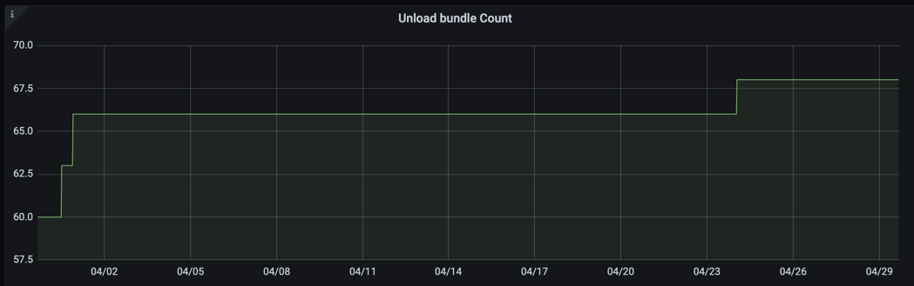

# 2. 监控

## 2. 监控

监控对于了解负载均衡算法的性能至关重要。在本节中，我们将讨论需要监控的关键指标以及如何解读它们。

## 2.1 卸载 bundle 数量

该指标表示已卸载的 bundle 的总数。当该指标的值增加时，表明负载均衡算法正在积极卸载 bundle。

```
pulsar_lb_unload_bundle_count # 2.11.0 之前
pulsar_lb_unload_bundles_total # 2.11.0 之后
```

从版本 2.11.0 开始，指标名称已由 `pulsar_lb_unload_bundle_count` 更改为 `pulsar_lb_unload_bundles_total`，相关改动通过 PR [Rename Pulsar lb metrics to specify OpenMetrics](https://github.com/apache/pulsar/pull/16611) 实现。



**注意**：此指标仅由 leader broker 导出，因此可以通过检查 `pulsar_lb_leader_broker` 指标来 **识别 leader broker**。

## 2.2 带宽使用率

```commandline
pulsar_lb_bandwidth_in_usage
pulsar_lb_bandwidth_out_usage
```


## 2.3 CPU 使用率

```commandline
pulsar_lb_cpu_usage
```


CPU 使用率是一个关键的监控指标。

## 2.4 内存和直接内存使用率

```commandline
pulsar_lb_memory_usage
pulsar_lb_direct_memory_usage
```


尽管直接内存使用率指标和内存使用率指标与实际负载关系不大，但为了防止 OOM 错误，我们仍然需要监控它们。
