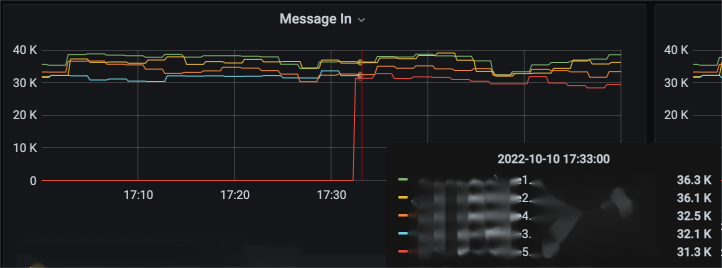

# Introduction

## **bundle**

In Pulsar, the load unit is referred to as a **bundle**, which can be understood as a container for topics. A bundle can contain multiple topics and uses a consistent hashing algorithm to map topic names to their corresponding bundles.

The bundle is the key to Pulsar's support for **millions of topic partitions**, as it significantly reduces the pressure on Zookeeper by several orders of magnitude.

Firstly, the ownership relationship of each broker over the topic partitions is represented by a ephemeral node on Zookeeper. When a broker attempts to obtain ownership of a topic, it creates the corresponding ephemeral node on Zookeeper. When the broker goes offline, the ephemeral node is automatically deleted, thereby releasing the ownership.

If bundles are not introduced, each topic partition would need a corresponding ephemeral node on Zookeeper. However, Zookeeper has a QPS limit of only tens of thousands and does not support horizontal scaling, thus limiting the topic limit of Pulsar to only tens of thousands.

By introducing the concept of bundles, only the ephemeral nodes corresponding to bundles need to be established on Zookeeper. Each bundle can accommodate dozens to hundreds of partitions, thereby reducing the pressure on Zookeeper by several orders of magnitude and supporting millions of topic partitions.

## **Shedding and Placement Strategies**

The concept of load balancing is quite straightforward and can be broadly divided into two steps:

* Unloading bundles from the heavily loaded brokerA.
* Distributing the unloaded bundles to the less loaded brokerB.

&#x20;These correspond to two interfaces in Pulsar:

* **LoadSheddingStrategy** is the **unloading(shedding) strategy**, responsible for identifying brokers with high load and unloading some of their bundles to reduce the load.
* **ModularLoadManagerStrategy** is the **placement strategy**, responsible for distributing bundles to less loaded brokers.

The `LoadSheddingStrategy` is designed to offload high-load broker bundles. However, to ensure the efficient operation of the cluster load balancing module, it is not only necessary to correctly "offload" but also to appropriately "place" the bundles. These two actions complement each other, and their coordination is crucial. In subsequent chapters, we will delve into this critical point.

Additionally, Pulsar supports multiple load balancers, with the default being `ModularLoadManagerImpl`. This article is also based on the use of the ModularLoadManagerImpl load balancer. The role of the load balancer includes collecting and reporting load data, executing shedding and placement strategies, and a good balancing effect is inseparable from accurate and timely load data information, which we will not expand on here.

## **Related Configuration**

First, let's understand some configurations. The following configurations are recommended to use the default values, which are introduced here for learning purposes only.

* loadBalancerEnabled

The `loadBalancerEnabled` configuration is used to control whether the load balancer is enabled. To use the load balancing feature, it must be turned on. The default configuration is set to true.

<figure><figcaption></figcaption></figure>

* loadBalancerSheddingEnabled

To enable the `LoadSheddingStrategy`, it is necessary to set `loadBalancerSheddingEnabled` to true.

If it is turned off, then it is not possible to actively identify brokers with high load. Unloading will only occur during broker restarts or when scaling the broker in or out, thus losing the ability for dynamic load balancing.

<figure><figcaption></figcaption></figure>

* loadBalancerSheddingIntervalMinutes

The execution interval of the `LoadSheddingStrategy` is determined by the configuration `loadBalancerSheddingIntervalMinutes`, which defaults to once every 1 minute.

<figure><figcaption></figcaption></figure>

* loadBalancerSheddingGracePeriodMinutes

During the bundle unload process, all topics contained within the bundle will temporarily become unavailable until the bundle is loaded onto a new broker. Therefore, bundle unloading also incurs a cost, as the topics included in the bundle will be unavailable during the load switching period, resulting in seconds of unavailability time.

To avoid frequent unloading of the same bundle, which could cause frequent traffic fluctuations for these topic partitions, the `LoadSheddingStrategy` filters out bundles that have been unloaded "not long ago" when selecting the candidate set for unloading. "Not long ago" is determined by the configuration `loadBalancerSheddingGracePeriodMinutes`, which defaults to 30 minutes.

<figure><figcaption></figcaption></figure>

* loadBalancerLoadSheddingStrategy

<figure><figcaption></figcaption></figure>

The configuration of `loadBalancerLoadSheddingStrategy` determines which shedding algorithm is used, with the default algorithm being `ThresholdShedder` starting from version 2.10. There are four available algorithms: `AvgShedder`, `ThresholdShedder`, `OverloadShedder`, and `UniformLoadShedder`.

<figure><figcaption></figcaption></figure>

* loadBalancerLoadPlacementStrategy

Placement strategy `ModularLoadManagerStrategy` is controlled by the configuration `loadBalancerLoadPlacementStrategy` and defaults to `LeastLongTermMessageRate`.

<figure><figcaption></figcaption></figure>

The implemented interface is named `ModularLoadManagerStrategy`, which has four implementations. However, `RoundRobinBrokerSelector` is generally not considered, as it places bundles using the RoundRobin method without considering real load and other metrics.

<figure><figcaption></figcaption></figure>

