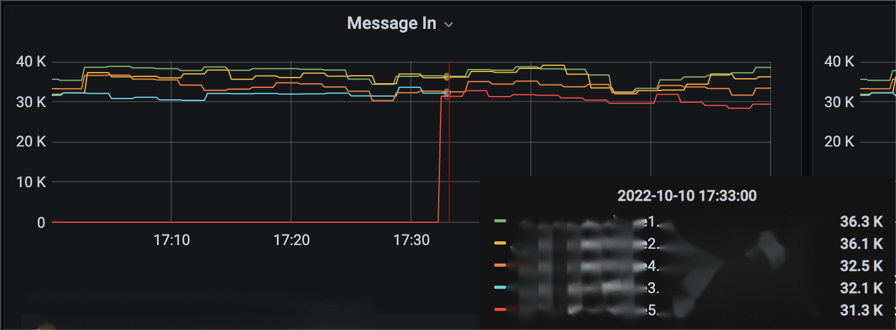

# 1. Scoring Algorithm

To identify high-load brokers, it is necessary to score and rank the brokers. There are currently two criterion for scoring:

* Broker resource utilization
* Broker message rate and throughput

&#x20;

From the previous analysis, we know that if we score broker **based on message rate and throughput**, like `UniformLoadShedder`, we will face issues in [heterogeneous environments](../chapter-2-load-balancing-algorithm-principles-and-analysis-load-shedding-strategy/3.-uniformloadshedder.md#id-3.3-evaluation). On the other hand, if we score broker **based on resource utilization**, we will encounter [over placement problems](../chapter-3-load-balancing-algorithm-principles-and-analysis-placement-strategy/1.-leastlongtermmessagerate.md#id-1.2-over-placement-issue) like `LeastResourceUsageWithWeight`. Is there any chance for us to design a perfect algorithm?

&#x20;

Upon further reflection on the root cause of the over placement problem in `LeastResourceUsageWithWeight`, it becomes evident that the over placement issue does not stem from the scoring basis. Instead, it is because the **shedding strategy and the placement strategy are two independent modules without information exchange.**&#x20;

Let's illustrate this with an example. When using the combination of `ThresholdShedder` and `LeastResourceUsageWithWeight` with default configurations, assume we have a set of brokers with scores of `20, 51, 52, 80, 80, 80`. The average score is calculated to be `60.5`. `ThresholdShedder` will identify the three brokers with score of 80 as high-load brokers and unload part of their bundles. According to the `LeastResourceUsageWithWeight` algorithm, only the broker with a score of 20 will be selected as a candidate broker. As a result, the unloaded bundles will all be assigned to this low-load broker, which may very likely turn it into the broker with the highest load.

However, if a human were to manually perform load balancing, a very straightforward and intuitive approach would be to evenly distribute the load between the broker with the highest score and the one with the lowest score (i.e., try to balance their throughput). This is the prototype of the `AvgShedder` algorithm.

Let's analyze the example mentioned above with this idea. Assuming that load sharing can make the scores of the two brokers the same, let a broker with a score of 80 and a broker with a score of 20 share the load. The scores of these two brokers will both become `(80 + 20) / 2 = 50`. Consequently, the original score sequence of `20, 51, 52, 80, 80, 80` will be transformed into `50, 50, 51, 52, 80, 80`. If we still think that the gap between 50 and 80 is too large, we can further execute load sharing. Therefore, we introduce a threshold. When the gap between the lowest and highest scores exceeds this threshold, bundle unloading will be triggered.&#x20;

The essence of this algorithm is that **when performing bundle unloading operations, the recipient is already specified**, rather than unloading a batch of bundles and determining the new owner  broker independently. In other words, while `LoadSheddingStrategy` is performing the unloading operation, it has already clarified the decision-making result of the subsequent `ModularLoadManagerStrategy`. Based on this, i made `AvgShedder` implement both the `LoadSheddingStrategy` and `ModularLoadManagerStrategy` interfaces, integrating the unloading and placement strategies into one.

<figure><figcaption></figcaption></figure>

To summarize, `AvgShedder` scores brokers **based on their resource utilization** to avoid problems caused by heterogeneous environments (adaptability issue), and effectively prevents over placement issue through the **integrated unloading and placement strategy.**

