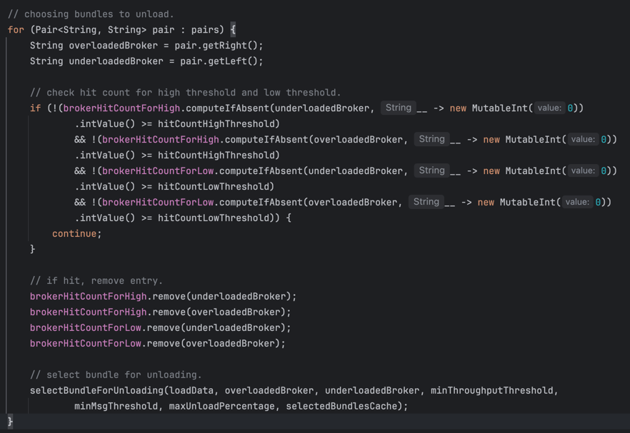

# 2. Multiple Times Trigger

## 2.1 Multiple Times Trigger

What about the [historical weight algorithm](../chapter-2-load-balancing-algorithm-principles-and-analysis-load-shedding-strategy/1.-thresholdshedder.md#id-1.2-historical-weight-algorithm) used by `ThresholdShedder` for scoring? It is designed to solve [load fluctuation problems](../chapter-4-load-balancing-algorithm-experimental-verification/1.-uniformloadshedder-+-leastlongtermmessagerate.md#id-1.3-load-fluctuation), but as proven by previous analysis and experiments, it has serious negative impacts. Consequently, we cannot use it to solve load fluctuation problems anymore and should tackle load fluctuation **(the stability issue)** via alternative means.

I devised a mechanism wherein **multiple consecutive threshold triggers** are requisite to eventually initiate a bundle unload operation. For example, when the gap between a pair of brokers reaches the threshold and this situation occurs **consecutively** three times, **load sharing** will be triggered.

The implementation of this mechanism also poses a question worthy of exploration. For example, consider three brokers. Broker1 has a load of 80, broker2 has a load of 80, and broker3 has a load of 20. Given that the loads of broker1 and broker2 are similar, during the shedding process, it is possible that in the first execution, broker1 is paired with broker3 and is determined to have reached the threshold; the second time might be broker2 paired with broker3 and determined to reach the threshold; and the third time, it might still be broker2 paired with broker3 and determined to reach the threshold. However, since broker2 and broker3 have **not consecutively triggered** the threshold three times, do we need to trigger a bundle unload operation in this case?&#x20;

**The answer is yes**. The reason is that we have set the condition of **consecutive threshold triggers**. If the pairs `<broker2, broker3>` and `<broker1, broker3>` alternate all the time, then a bundle unload operation will never be triggered. When there are many brokers with similar loads, it will take a long time to trigger a bundle unload.

&#x20;

Therefore, the implementation is as follows: Maintain a `Map<String, Integer>`, where the key is the broker name and the value is the number of trigger times.

* When a `Pair<brokerX, brokerY>` exceeds the threshold, insert `Entry<brokerX, 1>` and `Entry<brokerY, 1>` into the Map.
* In the next shedding process, if brokerX is again determined to be overloaded (or underloaded), update it to `Entry<brokerX, 2>`. If brokerX is not determined to be overloaded (or underloaded), remove `Entry<brokerX, 1>`. Note that the load status of brokerX will not affect the Entry of brokerY, thereby`Entry<brokerY, 1>` will not be deleted.
* When `Pair<brokerX, brokerZ>` exceeds the threshold and the Map is updated to `Entry<brokerX, 3>`, since the consecutive trigger count has reached the threshold of 3, a bundle unload operation will be triggered to balance the load between brokerX and brokerZ.

&#x20;

Let's illustrate this algorithm with the example above:

* First shedding: broker1 is paired with broker3, recording `Entry<broker1, 1>` and `Entry<broker3, 1>`.
* Second shedding: broker2 is paired with broker3, recording `Entry<broker2, 1>` and updating `Entry<broker3, 2>`, while removing `Entry<broker1, 1>`.
* Third shedding: regardless of whether the highest-load machine is broker1 or broker2, there will be `Entry<broker3, 3>`, thus triggering shedding. If the highest-load machine is broker1, the load between broker1 and broker3 will be balanced; if the highest-load machine is broker2, the load between broker2 and broker3 will be balanced.


&#x20;The implementation of this algorithm is as follows:

<figure><figcaption></figcaption></figure>


## 2.2 High and Low Threshold

In scenarios such as cluster rolling restarts and broker scaling, there are often significant load differences between different brokers. Since we hope to complete load balancing quickly, we have introduced two thresholds:

* `loadBalancerAvgShedderLowThreshold`, with a default value of 15
* `loadBalancerAvgShedderHighThreshold`, with a default value of 40

&#x20;

These two thresholds correspond to two different trigger count requirements:

* `loadBalancerAvgShedderHitCountLowThreshold`, with a default value of 8
* `loadBalancerAvgShedderHitCountHighThreshold`, with a default value of 2

&#x20;

When the score difference between a pair of brokers exceeds `loadBalancerAvgShedderLowThreshold` and consecutively reaches `loadBalancerAvgShedderHitCountLowThreshold`, or when the score difference exceeds `loadBalancerAvgShedderHighThreshold` and consecutively reaches `loadBalancerAvgShedderHitCountHighThreshold`, a bundle unload will be triggered.

For example, when the score difference exceeds 15, it needs to be consecutively triggered 8 times to trigger the bundle unload; whereas when the score difference exceeds 40, only 2 consecutive triggers are required. **The larger the load difference between brokers, the fewer the number of triggers required to initiate the bundle unload.** This design can adapt to scenarios such as broker scaling. Since load fluctuations typically do not cause such significant changes in broker load, this mechanism can achieve a good balance between stability and responsiveness.

<figure><figcaption><p>org.apache.pulsar.broker.loadbalance.impl.AvgShedder#findBrokerPairs</p></figcaption></figure>


## 2.3 Choosing Bundles for Unloading

When calculating the amount of traffic to unload, `AvgShedder` takes into account both message rate and throughput, giving precedence to the message rate. To avoid introducing too many configuration items, `AvgShedder` reuses the following three configurations from `UniformLoadShedder`:

```
    @FieldContext(
            dynamic = true,
            category = CATEGORY_LOAD_BALANCER,
            doc = "In the UniformLoadShedder and AvgShedder strategy, the minimum message that triggers unload."
    )
    private int minUnloadMessage = 1000;

    @FieldContext(
            dynamic = true,
            category = CATEGORY_LOAD_BALANCER,
            doc = "In the UniformLoadShedder and AvgShedder strategy, the minimum throughput that triggers unload."
    )
    private int minUnloadMessageThroughput = 1 * 1024 * 1024;

    @FieldContext(
            dynamic = true,
            category = CATEGORY_LOAD_BALANCER,
            doc = "In the UniformLoadShedder and AvgShedder strategy, the maximum unload ratio."
                    + "For AvgShedder, recommend to set to 0.5, so that it will distribute the load "
                    + "evenly between the highest and lowest brokers."
    )
    private double maxUnloadPercentage = 0.2;
```

* `minUnloadMessage` controls the minimum threshold for the message rate to be unloaded.
* `minUnloadMessageThroughput` controls the minimum threshold for the traffic throughput to be unloaded.
* `maxUnloadPercentage` is used to control the proportion of load sharing, with a default value of 0.2. Since our goal is to evenly distribute the load between two brokers, **it is recommended to set it to 0.5.** This way, after load balancing is completed, the message rates (i.e., traffic throughput) of the two brokers will be nearly equal. I have added a reminder in the comments.

<figure><figcaption></figcaption></figure>

<figure><figcaption><p>org.apache.pulsar.broker.loadbalance.impl.AvgShedder#selectBundleForUnloading</p></figcaption></figure>


